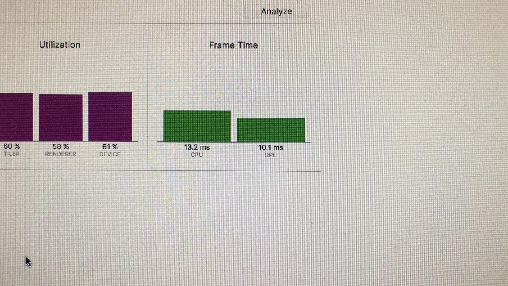
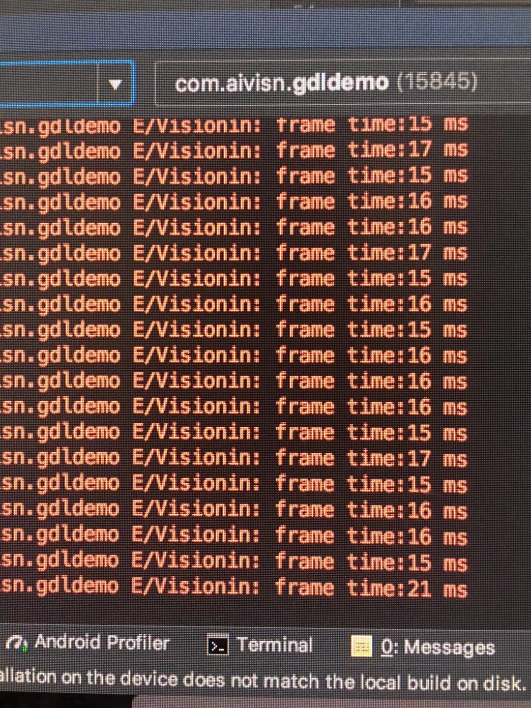

# libGDL
一个移动端跨平台的gpu+cpu并行计算的cnn框架。基于C++和opengles3.0开发，可以非常方便移植到任何一个支持opengles的平台上。

# 说明
* 本项目并非公司项目，纯粹为离职状态下的兴趣完成，个人条件限制待解决的问题还非常多(见下面TODO)。
* 有兴趣的开发者或者想沟通的欢迎联系我

* 代码框架说明文档见wiki：_https://github.com/rexbu/libGDL/wiki/%E8%AF%B4%E6%98%8E%E6%96%87%E6%A1%A3_

## libGDL特点
* 纯C++代码，没有依赖任何的第三方库，非常方便移植和编译。基于的libGPU是本人开发的一个C++版本的GPUImage
* 基于opengles 3.0实现，所以理论上libGDL可以应用于iphone5s及android 4.4之后的所有手机上
* 卷积层使用opengles的fbo渲染实现，全连接层基于neon优化，卷积层和全连接之间的数据传输通过pbo实现
* 卷积层和全连接层为并行计算

## TODO
* 详细的开发文档和说明文档后续会补充
* 重点放在了卷积层的优化上，全连接层只是简单使用了neon加速，还有较大优化空间
* 由于本人条件限制，android并未做较多的兼容性测试
* 卷积层的大部分时间都消耗在了纹理采样上，每个卷积层的计算速度和通道数、通道尺寸成正比。__哪位gpu的底层大牛协助下优化采样效率，速度还可以提升一个量级（注意是量级的提升！）__
* 目测android的显存有限，对于较大网络目前的框架会有问题。
* 卷积层和全连接层之间的数据交换使用pbo，但是我发现在少量iphone手机上，pbo并未起作用，耗时和glReadPixels耗时一样，这样会极大影响计算速度（可能在10ms以上）
* 对MobileNet、YOLO等常用模型的支持
* 模型转换目前只提供了tensorflow的ckpt格式转换

## 目录说明
* libGPU: 一个类似于GPUImage的跨平台opengles框架，支持2.0和3.0，项目地址：https://github.com/rexbu/libGPU
* src: libGDL的框架代码
* style: 基于libGDL定义的一个风格迁移源码
* tools: 一个以mnist为例的将tensorflow的ckpt模型转为gdl模型

## demo说明
程序里提供了2个demo，一个风格迁移、一个mnist。
* 风格迁移使用了9个卷积层、1个正则层、9个逆卷积层，这样规模的网络在我的小米4c(骁龙808)上跑不起来，暂时不清楚是不是显存太小导致的
风格迁移的demo由于网络规模的问题，所以无法做到实时，demo结果如图：

## 性能
mnist为例进行了性能测试，模型13.1M，第一个卷积层5*5*32，第二个卷积层5*5*64，第一个全连接层3136*1024，第二个全连接层1024*10。

### iphone5s的速度

### 小米4c的速度（骁龙808）

